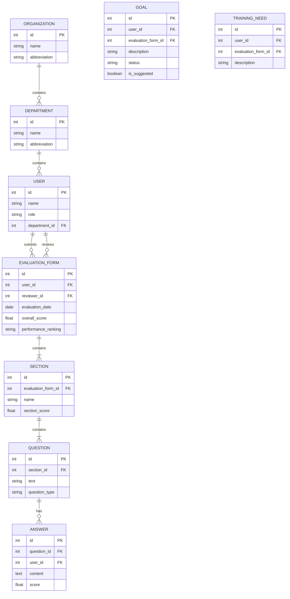

```mermaid
erDiagram
    ORGANIZATION ||--o{ DEPARTMENT : contains
    DEPARTMENT ||--o{ USER : contains
    USER ||--o{ EVALUATION_FORM : submits
    USER ||--o{ EVALUATION_FORM : reviews
    EVALUATION_FORM ||--|{ SECTION : contains
    SECTION ||--|{ QUESTION : contains
    QUESTION ||--o{ ANSWER : has
    USER {
        int id PK
        string name
        string role
        int department_id FK
    }
    ORGANIZATION {
        int id PK
        string name
        string abbreviation
    }
    DEPARTMENT {
        int id PK
        string name
        string abbreviation
    }
    EVALUATION_FORM {
        int id PK
        int user_id FK
        int reviewer_id FK
        date evaluation_date
        float overall_score
        string performance_ranking
    }
    SECTION {
        int id PK
        int evaluation_form_id FK
        string name
        float section_score
    }
    QUESTION {
        int id PK
        int section_id FK
        string text
        string question_type
    }
    ANSWER {
        int id PK
        int question_id FK
        int user_id FK
        text content
        float score
    }
    GOAL {
        int id PK
        int user_id FK
        int evaluation_form_id FK
        string description
        string status
        boolean is_suggested
    }
    TRAINING_NEED {
        int id PK
        int user_id FK
        int evaluation_form_id FK
        string description
    }
```