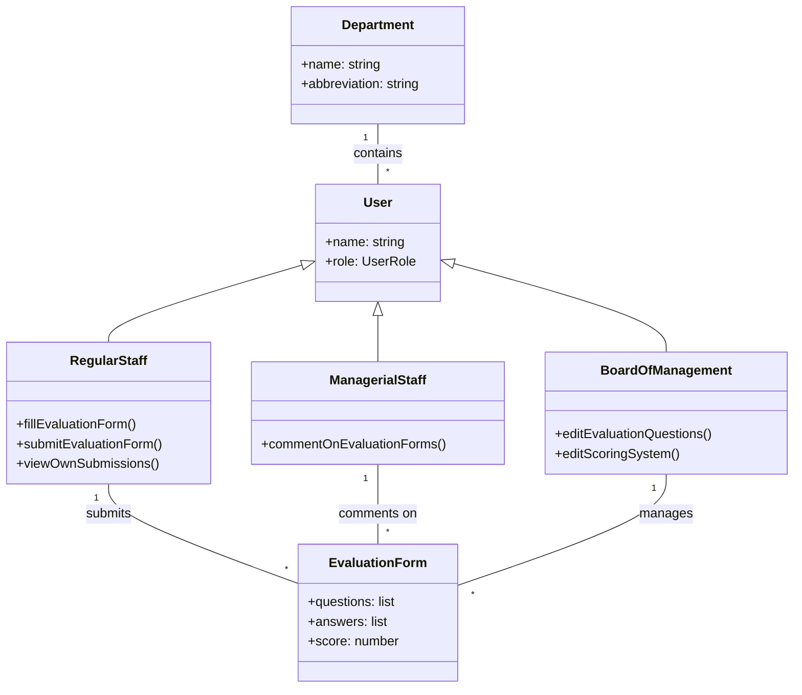

```mermaid
classDiagram
    class Department {
        +name: string
        +abbreviation: string
    }

    class User {
        +name: string
        +role: UserRole
    }

    class RegularStaff {
        +fillEvaluationForm()
        +submitEvaluationForm()
        +viewOwnSubmissions()
    }

    class ManagerialStaff {
        +commentOnEvaluationForms()
    }

    class BoardOfManagement {
        +editEvaluationQuestions()
        +editScoringSystem()
    }

    class EvaluationForm {
        +questions: list
        +answers: list
        +score: number
    }

    User <|-- RegularStaff
    User <|-- ManagerialStaff
    User <|-- BoardOfManagement
    Department "1" -- "*" User : contains
    RegularStaff "1" -- "*" EvaluationForm : submits
    ManagerialStaff "1" -- "*" EvaluationForm : comments on
    BoardOfManagement "1" -- "*" EvaluationForm : manages
```